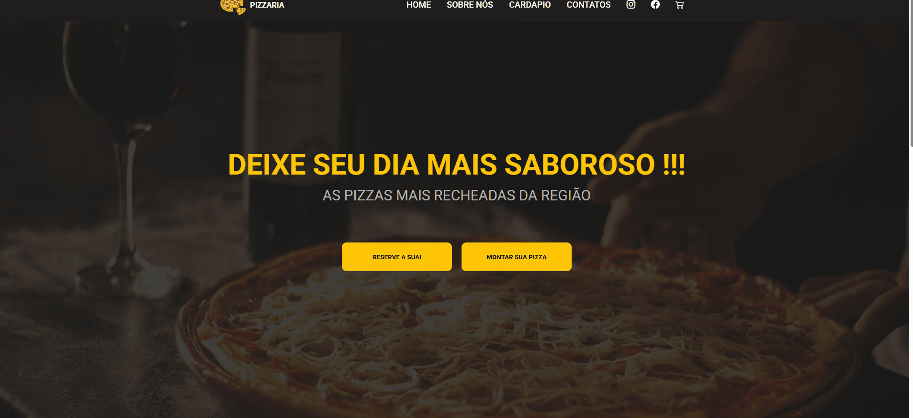

# 🍕 PizzaShop

> Landing page responsiva de uma pizzaria fictícia, desenvolvida com HTML, CSS e JavaScript, com foco em estruturação de layout, responsividade e interatividade.

---

## 🚀 Preview

- 📌 Layout completo com seções (Home, Sobre, Cardápio e Contatos)
- 📌 Menu responsivo com versão mobile (hambúrguer)
- 📌 Grid de produtos (cardápio)
- 📌 Design moderno com foco visual



---

## 💡 Contexto do projeto

Este projeto foi desenvolvido de forma autodidata como prática de conceitos fundamentais de front-end.

A proposta foi simular uma landing page real de uma pizzaria, aplicando na prática conceitos de estruturação de páginas, estilização e responsividade.

Durante o desenvolvimento, o foco foi consolidar conhecimentos essenciais para construção de interfaces web, incluindo organização de layout, adaptação para diferentes telas e interações básicas com JavaScript.

---

## 🛠️ Tecnologias utilizadas


---

## 📚 Conceitos aplicados

- Estruturação semântica com HTML
- Estilização com CSS (Flexbox e Grid)
- Responsividade com Media Queries
- Manipulação de DOM com JavaScript
- Menu mobile interativo
- Organização visual de componentes

---

## ⚙️ Funcionalidades

- ✅ Navegação entre seções da página
- ✅ Menu responsivo (desktop/mobile)
- ✅ Exibição de cardápio com grid adaptável
- ✅ Botões interativos
- ✅ Layout adaptado para diferentes tamanhos de tela

---

## ▶️ Como executar o projeto

```bash
# Clone o repositório
git clone https://github.com/seu-usuario/seu-repositorio.git

# Acesse a pasta
cd seu-repositorio

# Abra o arquivo
index.html
```

---

## 👨‍💻 Autor

Feito por **Vitor dos Reis**